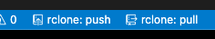

# code-server-deploy-container

An container image built for deploying code-server.

## Guides

- [Deploy on Railway](../guides/railway.md)
- [Deploy on Heroku](../guides/heroku.md)

Docker Hub: `bencdr/code-server-deploy-container`

To run the container locally, you can use:

```console
docker run -p 127.0.0.1:8080:8080 \
  -v "$PWD/project:/home/coder/project" \
  -u "$(id -u):$(id -g)" \
  -e "DOCKER_USER=$USER" \
  -e "PASSWORD=12345" \
  -it bencdr/code-server-deploy-container:latest
```

## Modifying your code-server environment

To update your code-server version, modify the version number on line 2 in your Dockerfile. See the [list of tags](https://hub.docker.com/r/codercom/code-server/tags?page=1&ordering=last_updated) for the latest version.

We've included some examples on how to add additoonal dependencies in the root-level [Dockerfile](../Dockerfile):

```Dockerfile
# Install a VS Code extension:
# Note: we use a different marketplace than VS Code. See https://github.com/cdr/code-server/blob/main/docs/FAQ.md#differences-compared-to-vs-code
RUN code-server --install-extension esbenp.prettier-vscode

# Install apt packages:
RUN sudo apt-get install -y ubuntu-make

# Copy files:
COPY deploy-container/myTool /home/coder/myTool
```

---

## Environment variables

| Variable Name      | Description                                                                                        | Default Value       |
| ------------------ | -------------------------------------------------------------------------------------------------- | ------------------- |
| `PASSWORD`         | Password for code-server                                                                           |                     |
| `HASHED_PASSWORD`  | Overrrides PASSWORD. [SHA-256 hash](https://xorbin.com/tools/sha256-hash-calculator) of password   |
| `USE_LINK`         | Use code-server --link instead of a password (coming soon)                                         | false               |
| `GIT_REPO`         | A git repository to clone                                                                          |                     |
| `DOTFILES_REPO`    | A [dotfiles](https://dotfiles.github.io/) repo to save preferences. Runs install.sh, if it exists. |                     |
| `DOTFILES_SYMLINK` | Symlinks dotfiles repo to $HOME, if exits.                                                         | true                |
| `START_DIR`        | The directory code-server opens (and clones repos in)                                              | /home/coder/project |

---

Other code-server environment variables (such as `CODE_SERVER_CONFIG` ) can also be used. See the [code-server FAQ](https://github.com/cdr/code-server/blob/main/docs/FAQ.md) for details.

## 💾 Persist your filesystem with `rclone`

This image has built-in support for [rclone](https://rclone.org/) so that your files don't get lost when code-server is re-deployed.

You can generate the rclone config on any machine, but it works great on the code-server environment itself, or Google Cloud Shell :)

```sh
# 1. install rclone
# see https://rclone.org/install/ for other install options
$ curl https://rclone.org/install.sh | sudo bash

# 2. create a new rclone remote with your favorite storage provider ☁️
$ rclone config

# 3. Encode your rclone config and copy to your clipboard
$ cat $(rclone config file | sed -n 2p) | base64 --wrap=0 # Linux
$ cat $(rclone config file | sed -n 2p) | base64 --b 0 # MacOS
```

Now, you can add the following the environment variables in the code-server cloud app:

| Environment Variable | Description                                                                                                                                           | Default Value                                | Required |
| -------------------- | ----------------------------------------------------------------------------------------------------------------------------------------------------- | -------------------------------------------- | -------- |
| RCLONE_DATA          | the encoded rclone config you copied in step 3                                                                                                        | n/a                                          | ✅       |
| RCLONE_REMOTE_NAME   | the name of the remote you added in step 2.<br />check with `$ rclone listremotes`                                                                    | code-server-remote                           |          |
| RCLONE_SOURCE        | source directory to sync files in the code-server container                                                                                           | the project directory: `/home/coder/project` |          |
| RCLONE_DESTINATION   | the path in the remote that rclone syncs to. change this if you have multiple code-server environments, or if you want to better organize your files. | code-server-files                            |          |
| RCLONE_VSCODE_TASKS  | import push and pull shortcuts into VS Code                                          | true                                         |
| RCLONE_AUTO_PUSH     | automatically push files on startup if the rclone remote is empty (environment -> rclone remote)                                                      | true                                         |          |
| RCLONE_AUTO_PULL     | automatically pull files on startup if the rclone remote is not empty (rclone -> environment remote)                                                  | true                                         |          |
| RCLONE_FLAGS         | additional flags to attach to the push and pull script.<br />type `$ rclone help flags` for a list.                                                   |                                              |          |

```sh

# --- How to use ---

# Terminal:
$ sh /home/coder/push_remote.sh # save your uncomitted files to the remote
$ sh /home/coder/pull_remote.sh # get latest files from the remote

# In VS Code:
# use items in bottom bar or ctrl + P, run task: push_remote or pull_remote or
```

### Popular rclone flags

To avoid syncing unnecessary directories, add this to `RCLONE_FLAGS` :

```none
--exclude "node_modules/**" --exclude ".git/**"
```

---

## Todo

- [ ] Make `push_remote` and `pull_remote` commands in path
- [ ] Impliment file watcher or auto file sync in VS Code
- [ ] Attach a "push" on a git stash??
- [ ] Add support for SSH / VS Code remote access
- [ ] Make rclone logs visible in environment for debugging
