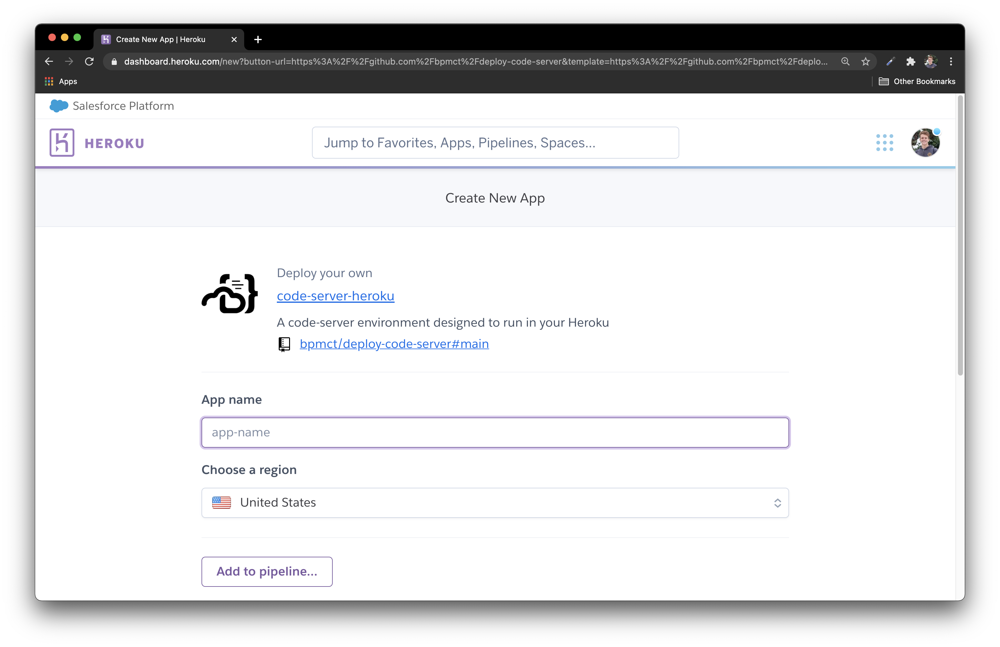
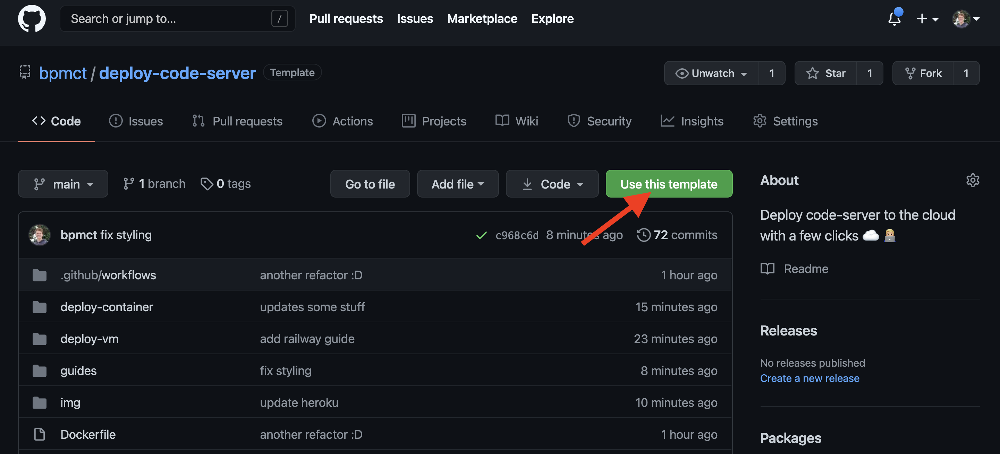

# Guide: Launching `code-server` on Heroku

Heroku is a managed app hosting platform.

Launch code-server on Heroku to get on-demand dev environments that turn off when you don't need them! 💵



## Step 1: Click to deploy

[](https://heroku.com/deploy?template=https://github.com/bpmct/code-server-heroku/tree/main)

---

## Step 2: Configure & deploy your environment

`App name`: The URL and you can access code-server with

`PASSWORD`: A password you can use to log in

`GIT_REPO`: The HTTPS URL of a git repo you'd like to use in code-server. (optional)

After it has built, you can access it by pressing "View" or "Open app."

## Step 3: Create a new GitHub repo with this template



Press the button in the top right of the repo, or or click to [use this template](https://github.com/bpmct/deploy-code-server/generate).

## Step 4: Set up automatic builds with this repo

1. In Heroku, navigate to `Deploy -> Deployment Method"
1. Link it with the GitHub repo you just created.
1. Open the repo in GitHub and edit the `Dockerfile`
1. Add some custom tools (like NodeJS) and commit to the main branch:

   ```Dockerfile
   # You can add custom software and dependencies for your environment here. Some examples:

   # RUN code-server --install-extension esbenp.prettier-vscode
   # RUN sudo apt-get install -y build-essential
   # RUN COPY myTool /home/coder/myTool

   # Install NodeJS
   RUN sudo curl -fsSL https://deb.nodesource.com/setup_15.x | sudo bash -
   RUN sudo apt-get install -y nodejs
   ```

1. Head back to Heroku and notice a new deployment has started. After it has completed, you can use these tools in your environment.

1. (Optional): [Configure rclone](https://github.com/cdr/deploy-code-server/tree/main/deploy-container#-persist-your-filesystem-with-rclone) so that you can save your VS Code config and files without commiting

See the [deploy-container README](../deploy-container) for other config vars for your environment. 