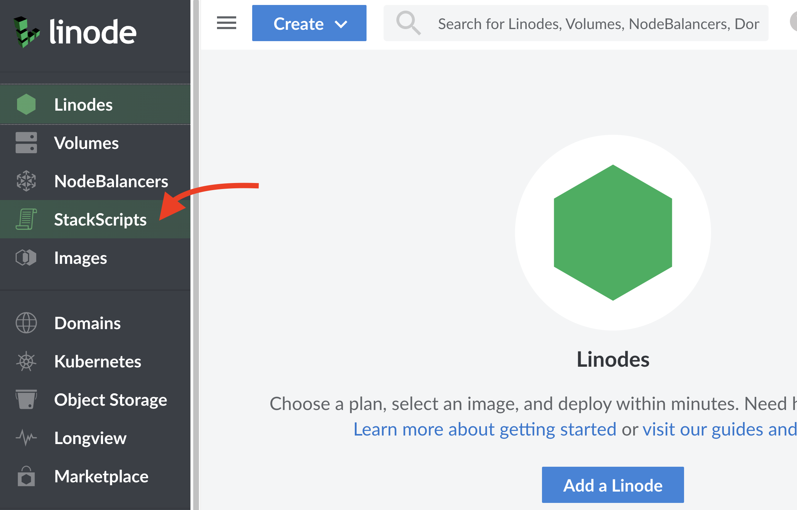
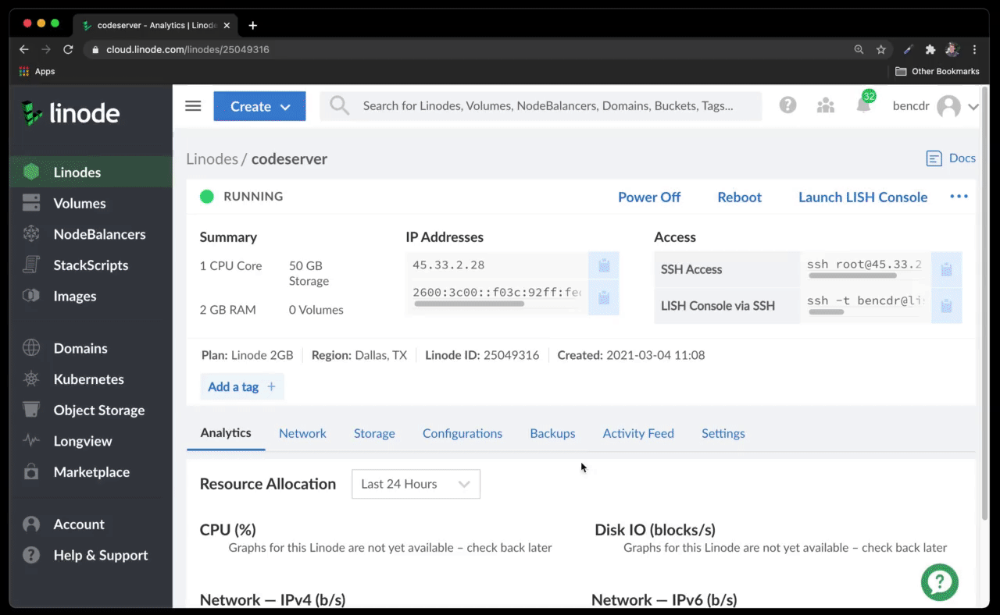

# deploying `code-server` on Linode

[Linode](https://linode.com) is a developer-friendly platform with cloud servers. Here is the easiest way to launch code-server on Linode.

1. Log in to Linode and go to the "StackScripts" section in the sidebar

   

1. Navigate to "Community Scripts" and use `bencdr/code-server` or create your own based on [launch-code-server-linode.sh](../deploy-vm/launch-code-server-linode.sh).

1. Give your server a label and deploy with Ubuntu 20.10 and any size. Once your server starts, you can simply navigate to the IP address and get forwarded to a secure version of code-server, which will be proxied behind your GitHub account. For information on how this works, see [code-server --link](https://github.com/cdr/code-server#cloud-program-%EF%B8%8F).

   

1. Optional: To change the URL in the address bar from `linode-[xxxx]` to something more descriptive, you just need to change your hostname and restart code-server:
   ```sh
   sudo hostnamectl set-hostname bens-devbox
   sudo systemctl restart code-server@coder
   ```
