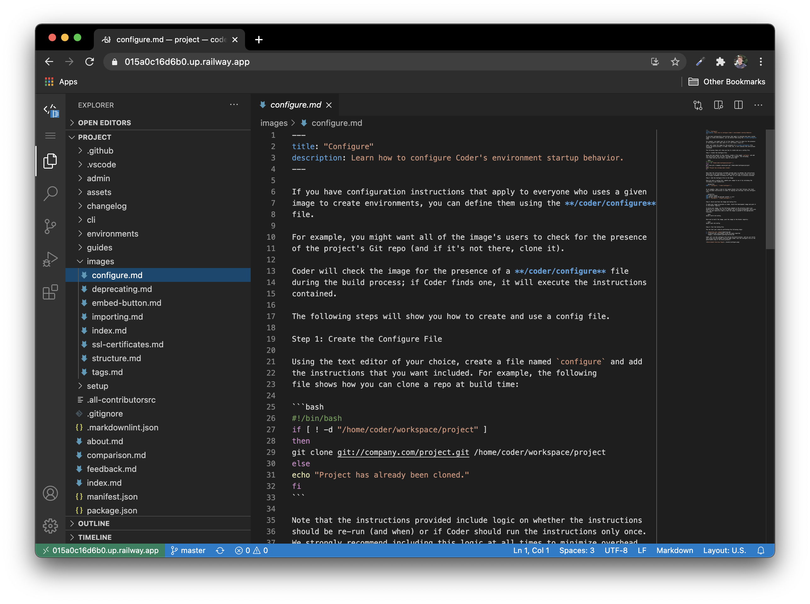
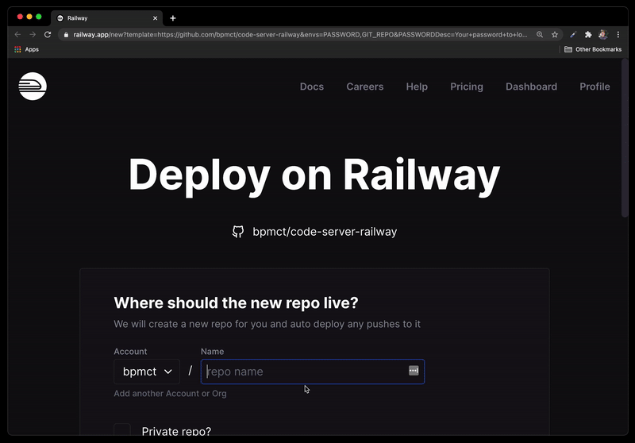
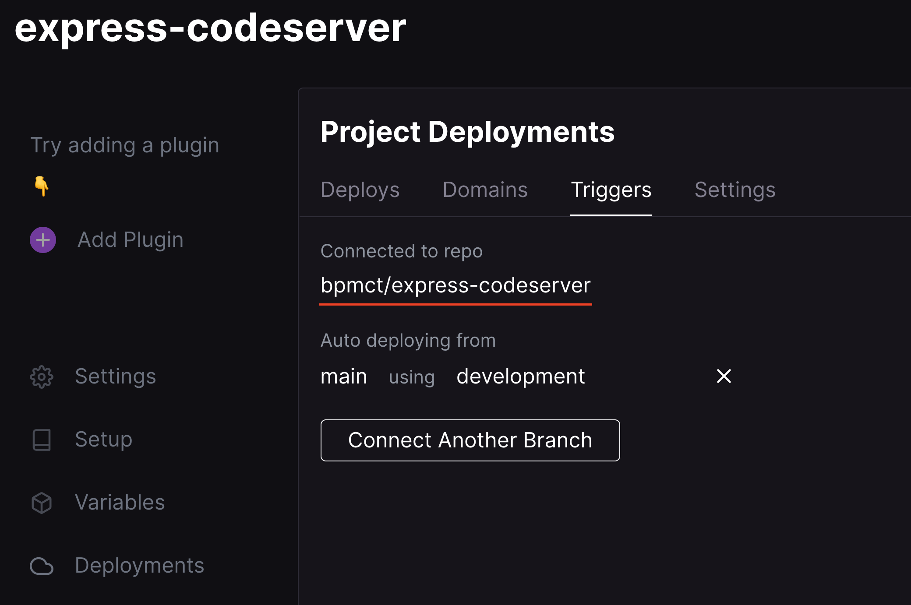

# Guide: Launching `code-server` on railway.app

[Railway](https://railway.app) is a new cloud development platform! ☁️

Use Railway + code-server to get a dev environment that you can access from any device.



## Step 1: Click button to deploy

[](https://railway.app/new/template?template=https%3A%2F%2Fgithub.com%2Fcoder%2Fdeploy-code-server&envs=PASSWORD%2CGIT_REPO&optionalEnvs=GIT_REPO&PASSWORDDesc=Your+password+to+log+in+to+code-server&GIT_REPODesc=A+git+repo+to+auto-clone+and+open+in+code-server+%28e.g+https%3A%2F%2Fgithub.com%2Fcoder%2Fdocs%29)

## Step 2: Configure & launch your environment

You'll need to make a new repository which will contain your code-server configuration. If you push changes to this repo (to install NodeJS, for example), it will re-deploy code-server.



You also need to specity a `PASSWORD` and a `GIT_REPO` to clone in your environment :)

## Step 3: Modify your environment to add additional tools

1. In Railway, go to `Deployments -> Triggers` to see your source repo.

   

1. Open the source repo in GitHub and edit the `Dockerfile`
1. Add some custom tools (like NodeJS) and push to the main branch:

   ```Dockerfile
   # You can add custom software and dependencies for your environment here. Some examples:

   # RUN code-server --install-extension esbenp.prettier-vscode
   # RUN sudo apt-get install -y build-essential
   # RUN COPY myTool /home/coder/myTool

   # Install NodeJS
   RUN sudo curl -fsSL https://deb.nodesource.com/setup_15.x | sudo bash -
   RUN sudo apt-get install -y nodejs
   ```

1. Head back to Railway and notice a new deployment was created. After it has completed, you can use these tools in your environment.

1. (Optional): [Configure rclone](https://github.com/cdr/deploy-code-server/tree/main/deploy-container#-persist-your-filesystem-with-rclone) so that you can save your VS Code config and files without commiting

See the [deploy-container README](../deploy-container) for other config vars for your environment. These variables, such as your password, can be managed in the "Variables" section of your project in railway.

---

To update your code-server version, modify the version number on line 2 in your Dockerfile. See the [list of tags](https://hub.docker.com/r/codercom/code-server/tags?page=1&ordering=last_updated) for the latest version.
