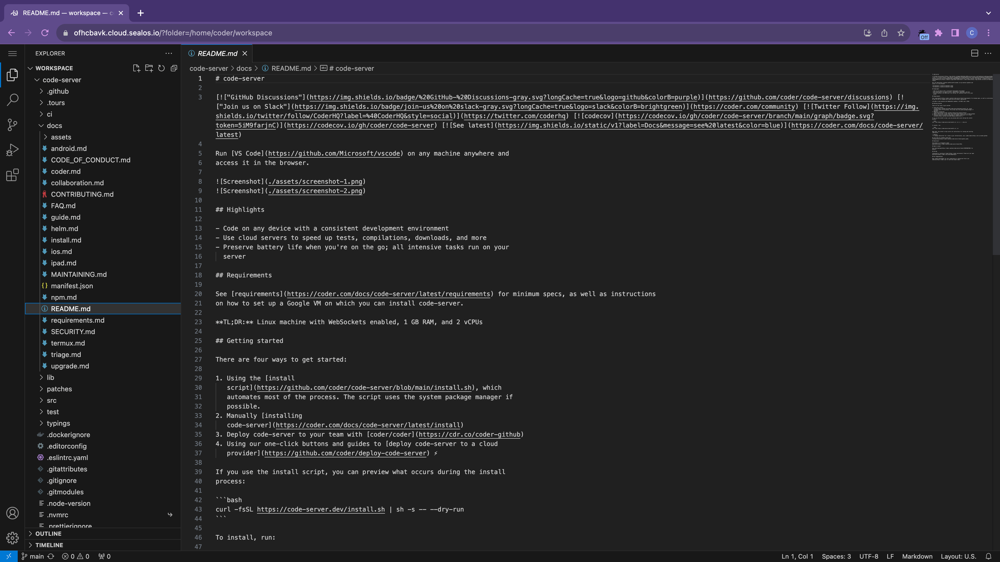

# Guide: Launching `code-server` on Sealos

[Sealos](https://sealos.io) is a cloud operating system designed for managing cloud-native applications.

Use Sealos + code-server to get a dev environment that you can access from any device.

## Step 1: Click button to deploy

## Step 2: Configure & deploy your environment

`PASSWORD`: A password you can use to log in

After deployment, you can access it by pressing "Confirm"